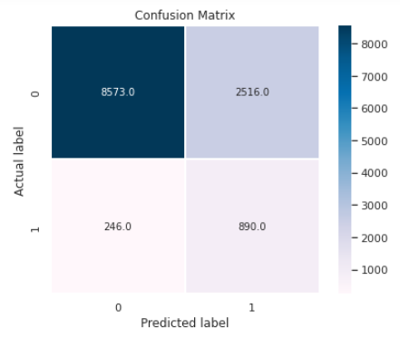
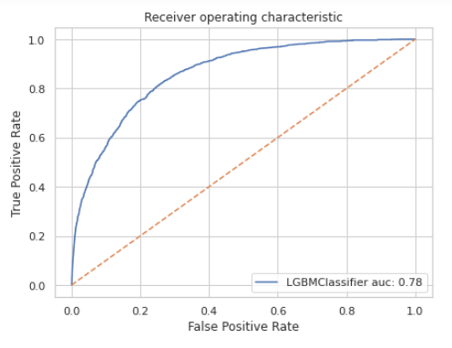

Badge [source](https://shields.io/)

#


## Authors

- [@semasuka](https://www.github.com/sachimugu)

## Table of Contents

  - [Business problem](#business-problem)
  - [Data source](#data-source)
  - [Tech Stack](#tech-stack)
  - [Quick glance at the results](#quick-glance-at-the-results)
  - [Lessons learned and recommendation](#lessons-learned-and-recommendation)
  - [Limitation and what can be improved](#limitation-and-what-can-be-improved)
  - [Run Locally](#run-locally)
  - [Explore the notebook](#explore-the-notebook)
  - [Deployment on streamlit](#deployment-on-streamlit)
  - [App deployed on Streamlit](#app-deployed-on-streamlit)
  - [Repository structure](#repository-structure)
  - [Contribution](#contribution)
  - [License](#license)


## Business problem

In clinical practice, estimates of
mortality risk can be useful in triage and resource allocation, to determine appropriate levels of care, to prepare discussions with patients and their families around expected outcomes and help policymakers identify and make better health policies.

Objective of this project is to create a model that uses data from the early hours of intensive care to predict patient survival with better prediction probability than apache,minimize apache features, transparent (easy to explain, and generalizability with Less complexity. As current systems often lack generalizability beyond the patients on whom the models were developed, and The models are often proprietary, costly to use (APACHE scoring system...), and suffer from opaque algorithms 
## Data Source
MIT's GOSSIS community initiative, with privacy certification from the Harvard Privacy Lab,  provided the dataset of more than 90000 hospital Intensive Care Unit (ICU) visits from patients, spanning a one-year timeframe. The data is part of a growing global effort and consortium spanning Argentina, Australia, New Zealand, Sri Lanka, Brazil, and more than 200 hospitals in the United States.


## Tech Stack

- Python (refer to requirement.txt for the packages used in this project)
- django (interface for the model)
- Html/Css


## Quick glance at the results

Confusion matrix of light gradient boosting classifier.



ROC curve of gradient boosting classifier.



Top 3 models (with default parameters)

| Model     	            | Recall score 	    |
|-------------------	    |------------------	|
| Logistic Regression   	| 65% 	            |
| Gradient boosting    	  | 78% 	            |
| Light Gradient boosting       | 78% 	            |

- ```The final model used is Light Gradient boosting because```
1. Faster traning time
2. Lower memory usage 
3. Support parrallisation on distributed systems
4. Better prediction probability
#### Metrics used: Recall and ROC_AUC
Why choose Recall and ROC_AUC as metrics:
  - Since the objective of this problem is to  predict patient survival in the early hour of icu admision, Recall will be a better metric as inaccurate prediction of low survival (false negative) will have dire consequences.
  - ROC_AUC so we can be able to set the best threashold to capture low survival(True positives)
  - Imbalance between dataset

## Lessons learned and recommendation

- Based on the analysis on this project, we found out that income, family member count and employment length, are the most predictive features to determine if an applicant will be approved for a credit card or not. Other features like age and working employment status are also useful. The least useful features are: type of dwelling and car ownership.
- Recommendation would be to focus more on the most predictive feature when looking at the applicant profile, and pay less attention on the least predictive features.
## Limitation and what can be improved
- Minimum domain knowledge
- Highly imbalanced dataset
- Plenty of missing variables
- Hyperparameter tuning: I used RandomSearchCV to save time but could be improved by couple of % with GridSearchCV.
- More data: Alot of factor contrribute to a patient survival in the ICU. Factor such, Qaulity of hospital, experience of doctor etc are not captured in the dataset 


## Run Locally


## Explore the notebook

To explore the notebook file [here](https://nbviewer.org/github/semasuka/Credit-card-approval-prediction-classification/blob/main/Credit_card_approval_prediction.ipynb)


## App deployed on Streamlit


Video to gif [tool](https://ezgif.com/)
## Repository structure


## Contribution

Pull requests are welcome! For major changes, please open an issue first to discuss what you would like to change or contribute.

## License

MIT License
Copyright (c) 2022 Achimugu suleiman

Permission is hereby granted, free of charge, to any person obtaining a copy
of this software and associated documentation files (the "Software"), to deal
in the Software without restriction, including without limitation the rights
to use, copy, modify, merge, publish, distribute, sublicense, and/or sell
copies of the Software, and to permit persons to whom the Software is
furnished to do so, subject to the following conditions:

The above copyright notice and this permission notice shall be included in all
copies or substantial portions of the Software.

<small>THE SOFTWARE IS PROVIDED "AS IS", WITHOUT WARRANTY OF ANY KIND, EXPRESS OR
IMPLIED, INCLUDING BUT NOT LIMITED TO THE WARRANTIES OF MERCHANTABILITY,
FITNESS FOR A PARTICULAR PURPOSE AND NONINFRINGEMENT. IN NO EVENT SHALL THE
AUTHORS OR COPYRIGHT HOLDERS BE LIABLE FOR ANY CLAIM, DAMAGES OR OTHER
LIABILITY, WHETHER IN AN ACTION OF CONTRACT, TORT OR OTHERWISE, ARISING FROM,
OUT OF OR IN CONNECTION WITH THE SOFTWARE OR THE USE OR OTHER DEALINGS IN THE
SOFTWARE.</small>

Learn more about [MIT](https://choosealicense.com/licenses/mit/) license
