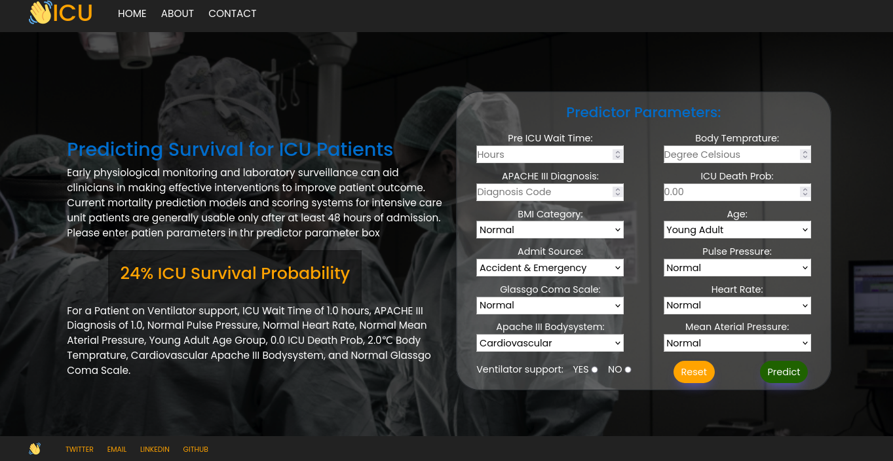

# ICU SURVIVAL PREDICTION

## Table of Contents

  - [Business problem](#business-problem)
  - [Quick glance at the results](#quick-glance-at-the-results)
  - [Limitation and what can be improved](#limitation-and-what-can-be-improved)
  - [Run Locally](#run-locally)
  - [Repository structure](#repository-structure)

## 1. Business problem
<a name = "intro"></a>
The challenge is to create a model that uses data from the early hours of intensive care unit addmission to predict patient survival. In clinical practice, estimates of mortality risk can be useful in triage and resource allocation, to determine appropriate levels of care, to prepare discussions with patients and their families around expected outcomes and help policymakers identify and make better health policies.

### 1.1 Objective
Objective of this project is to create a model predict patient survival with better prediction probability than the current apache, model that uses minimize apache features, transparent i.e easy to explain, and generalizability with Less complexity. As current systems often lack generalizability beyond the patients on whom the models were developed, and The models are often proprietary, costly to use (APACHE scoring system...), and suffer from opaque algorithms.

### 1.2 Data Source
MIT's GOSSIS community initiative, with privacy certification from the Harvard Privacy Lab, has provided a dataset of more than  90000 hospital Intensive Care Unit (ICU) visits from patients, spanning a one-year time frame. This data is part of a growing global effort and consortium spanning Argentina, Australia, New Zealand, Sri Lanka, Brazil, and more than 200 hospitals in the United States.


## 2. Quick glance at the results

Confusion matrix of light gradient boosting classifier.


ROC curve of gradient boosting classifier.


Top 3 models (with default parameters)

| Model     	            | Recall score 	    |
|-------------------	    |------------------	|
| Logistic Regression   	| 65% 	            |
| Gradient boosting    	  | 78% 	            |
| Light Gradient boosting       | 78% 	            |

- ```The final model used is Light Gradient boosting because```
1. Faster traning time.
2. Lower memory usage.
3. Support parrallisation on distributed systems.
4. Better prediction probability.
### 2.1 Metrics Used: Recall and ROC_AUC
Why choose Recall and ROC_AUC as metrics:
  - Since the objective of this problem is to  predict patient survival in the early hour of icu admision, Recall will be a better metric as inaccurate prediction of low survival (false negative) will have dire consequences.
  - ROC_AUC so we can be able to set the best threashold to capture low survival(True positives).
  - Imbalance between dataset.
### 2.2 Limitations And What Can Be Improved
- Minimum domain knowledge.
- Highly imbalanced dataset.
- Plenty of missing variables.
- Hyperparameter tuning: I used RandomSearchCV to save time but could be improved by couple of % with GridSearchCV.
- More data: Alot of factor contrribute to a patient survival in the ICU. Factor such, Qaulity of hospital, experience of doctor etc are not captured in the dataset. 

## 3. Run Locally
```bash
# clone the project.
git clone https://github.com/Sachimugu/ICU-survival.git
```
```bash
# Create a conda virtual environment called icuprediction and install all the packages.
conda create --name icuprediction pandas sklearn Django lightgbm
```
```bash
# Activate the conda environment.
conda activate icuprediction
```
```bash
# enter the Script  directory.
cd ./site/django-web-app
```
```bash
# run server.
python manage.py runserver
```
Go to http://127.0.0.1:8000/ on web-brower
## Repository structure
```
├── assets
│   ├── age.png
│   ├── bmi.jpg
│   ├── Bmi.png
│   ├── cm.png
│   ├── data.png
│   ├── gcs.jpg
│   ├── gcs.png
│   ├── GCS_Subscales.png
│   ├── roc.png
│   └── sc.png
├── Datasets
│   ├── clean_dataset
│   ├── clean_dataset.csv
│   ├── Data Dictionary.csv
│   ├── dataset.csv
│   └── model_metrics.csv
├── Model
│   └── pickel_lgb_model.pkl
├── Notebook
│   ├── 1_Data_Wranglin_and_Analysis.ipynb
│   ├── 2_Preprocessing_and_ML_Model.ipynb
│   └── US_States_ID.json
├── Presentation
│   ├── report.pdf
│   └── reportp.pptx
└── README.md
```
#### Contribution
Pull requests are welcome! For major changes.

### Contact
<a href="mailto:sachimugu@outlook.com">  </a>
<a href="https://www.linkedin.com/in/achimugu-a-79aa8a18a/">  </a>
<a href="https://twitter.com/achimugu_a">  </a>
<a href="https://medium.com/@sachimugu">  </a>

